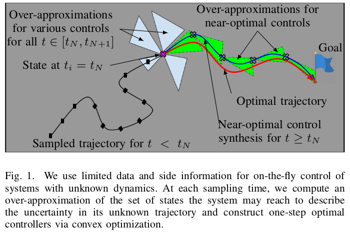

| Title      | On-The-Fly Control of Unknown Smooth Systems from Limited Data systems                 |
|------------|----------------------------------------------------------------------------------------------|
| Authors    | Franck Djeumou, Abraham P. Vinod, Eric Goubault, Sylvie Putot, and Ufuk Topcu                                                |
| Conference | American Control Conference, 2021                                                            |



**Disclaimer:** The code is provided as-is, no updates expected. A new and complete version of `DaTaReach` and `DaTaControl` (data-driven algorithms to over-approximate the reachable set and control unknown systems, respectively) based on recent results will be upload soon.

This repository provides codes to reproduce the experiments and figures of the paper.
-   Construction of data-driven differential inclusions and computation of over-approximations of the reachable set of dynamics described by the differential inclusions.
    -   Figures 2 and 3 in the paper are given by `Unicycle_diff_inclusion_and_reach_set.ipynb`
-   Empirical comparison of our algorithm `DaTaControl` with data-driven approaches `C2Opt`(https://github.com/u-t-autonomous/ACC2020_C2Opt), `SINDYc`, `CGP-LCB`, and `Opt. Traj.` solving the optimal control problem if the dynamics were known.
    -   **Unicycle:** Figure 4 in the paper is given by `Unicycle_datacontrol.ipynb`
    -   **Quadrotor:** Figure 5 in the paper is given by `Quadrotor_datacontrol.ipynb`

# Installation and Reproducibility Instructions

First, clone this repository and navigate inside the directory
```
git clone https://github.com/u-t-autonomous/ACC2021_DaTaReach_DaTaControl.git
cd ACC2021_DaTaReach_DaTaControl
```

In order to get the exact environment used for developing and testing this code, execute the following commands
```
conda env create --file datarc_env.yml
conda activate datarc_env
# python -m pip install -e .
# # Install also `C2Opt` (an older version) attached with this repository
# cd ACC2020_C2Opt/congol/
# python -m pip install -e .
# cd ../../
```

# Getting Started

# Read the Paper for Important Details

Most of the conceptual details for this repository are primarily described in the final version of the paper. Here, we provide the extended version on Arxiv of the conference paper.
```
@misc{djeumou2021onthefly,
      title={On-The-Fly Control of Unknown Smooth Systems from Limited Data},
      author={Franck Djeumou and Abraham P. Vinod and Eric Goubault and Sylvie Putot and Ufuk Topcu},
      year={2021},
      eprint={2009.12733},
      archivePrefix={arXiv},
      primaryClass={eess.SY}
}
```

# Contact

Please contact Franck Djeumou (fdjeumou@utexas.edu) for questions regarding this code.
